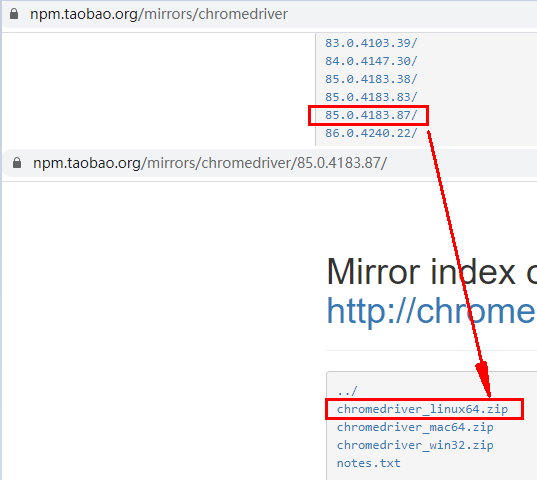

# 构建python运行的docker

## 组成

- 基于docker ubuntu18.04(64位)
- python3 + pip3
- chrome浏览器
- 预装selenium, bs4, pyquery, requests
- ubuntu源为中科大镜像站


## 获取方法

```
docker pull youngbest/python-dev
```


## 版本信息

chrome

```
https://dl.google.com/linux/direct/google-chrome-stable_current_amd64.deb
~# google-chrome-stable --version
Google Chrome 85.0.4183.121
```


chromedriver

根据chrome stable的版本，到下面这个网站下载最接近的版本即可

```
https://npm.taobao.org/mirrors/chromedriver
~# chromedriver --version
ChromeDriver 85.0.4183.87 (cd6713ebf92fa1cacc0f1a598df280093af0c5d7-refs/branch-heads/4183@{#1689})
```



## 配置pip镜像

创建container并进入之后，执行下面这个命令，可以将pip的镜像设置成阿里的源

```
pip config set global.index-url https://mirrors.aliyun.com/pypi/simple/
```

后面的地址可以换成其它镜像源